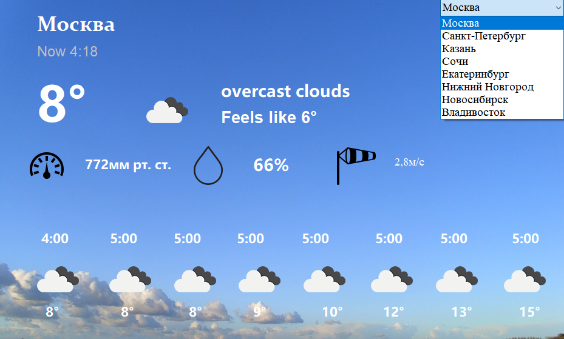

 <h1> WeatherForecast- с# API </h1> 

 A simple weather forecast for different cities for the next few hours

 <h1>  Information </h1> 

Demonstration of the possibility of working with api. The program makes a request about the weather to a third-party resource and displays on the graphical interface

 <h1>  Install/Setting </h1> 

For the bots to work, you need to configure the class Setting.cs.  You can get an individual api token on the website https://openweathermap.org/api

# Discord/Support
You can contact me by mail torretoadv@gmail.com
